# Neural Semantic Segmentation

Implementations of neural network papers for semantic segmentation using Keras
and TensorFlow.

## Installation

To install requirements for the project:

```shell
python -m pip install -r requirements.txt
```

## Hardware Specification

Results were generated using a machine equipped with  128GB RAM, nVidia P100
GPU, and Intel Xeon CPU @ 2.10GHz. All results shown are from the testing
dataset.

## [CamVid][]

-   [32 classes][CamVid-classes] generalized to 11 classes using mapping in
    [11_class.txt](11_class.txt)
    -   use 12 labels and ignore the Void class (i.e., 11 labels)
-   960 x 720 scaled down by factor of 2 to 480 x 360

[CamVid]: http://mi.eng.cam.ac.uk/research/projects/VideoRec/CamVid/
[CamVid-classes]: http://mi.eng.cam.ac.uk/research/projects/VideoRec/CamVid/#ClassLabels

## [SegNet][Badrinarayanan et al. (2015)]

<table>
  <tr>
    <td>
        
    </td>
    <td>
        
    </td>
  </tr>
</table>

The following table describes training hyperparameters.

| Crop Size | Epochs | Batch Size | Patience | Optimizer | α    | 𝛃    | α Decay |
|:----------|:-------|:-----------|:---------|:----------|:-----|:-----|:--------|
| 352 x 480 | 200    | 8          | 50       | SGD       | 1e-3 | 0.9  | 0.95    |

-   batch normalization statistics computed per batch during training and
    using a rolling average computed over input batches for validation and
    testing
    -   original paper uses a static statistics computed over the training data
-   encoder transfer learning from VGG16 trained on ImageNet
-   best model in terms of validation accuracy is kept as final model
-   median frequency balancing of class labels ([Eigen et al. (2014)][])
    -   weighted categorical cross-entropy loss function
-   local contrast normalization of inputs ([Jarrett et al. (2009)][])
-   pooling indexes ([Badrinarayanan et al. (2015)][])

### Quantitative Results

The following table outlines the testing results from SegNet.

| Metric                  | Test Score |
|:------------------------|:-----------|
| Global Accuracy         | 0.888466
| Mean Per Class Accuracy | 0.593288
| Mean I/U                | 0.495996
| Bicyclist               | 0.301233
| Building                | 0.693133
| Car                     | 0.503114
| Column/Pole             | 0.218290
| Fence                   | 0.152144
| Pedestrian              | 0.332084
| Road                    | 0.887113
| Sidewalk                | 0.756714
| Sign                    | 0.161815
| Sky                     | 0.871147
| Vegetation              | 0.579169

### Qualitative Results

<table>
  <tr>
    <td>
      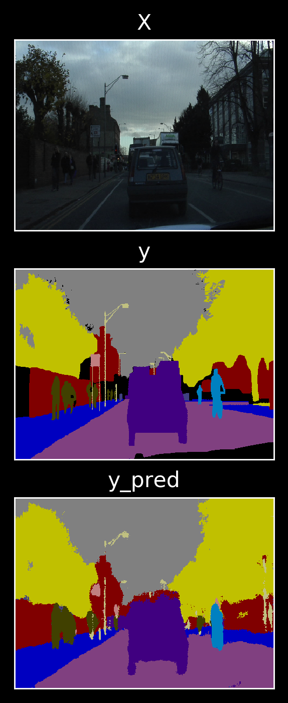
    </td>
    <td>
      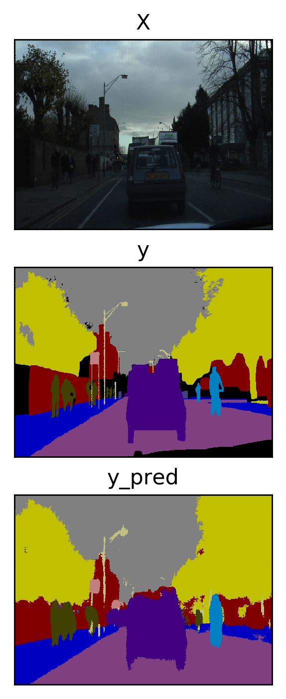
    </td>
    <td>
      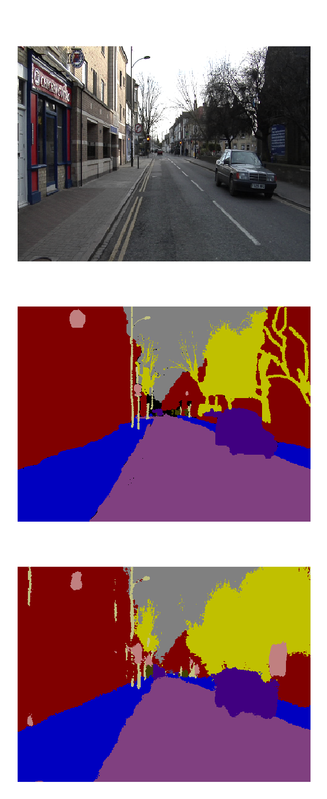
    </td>
    <td>
      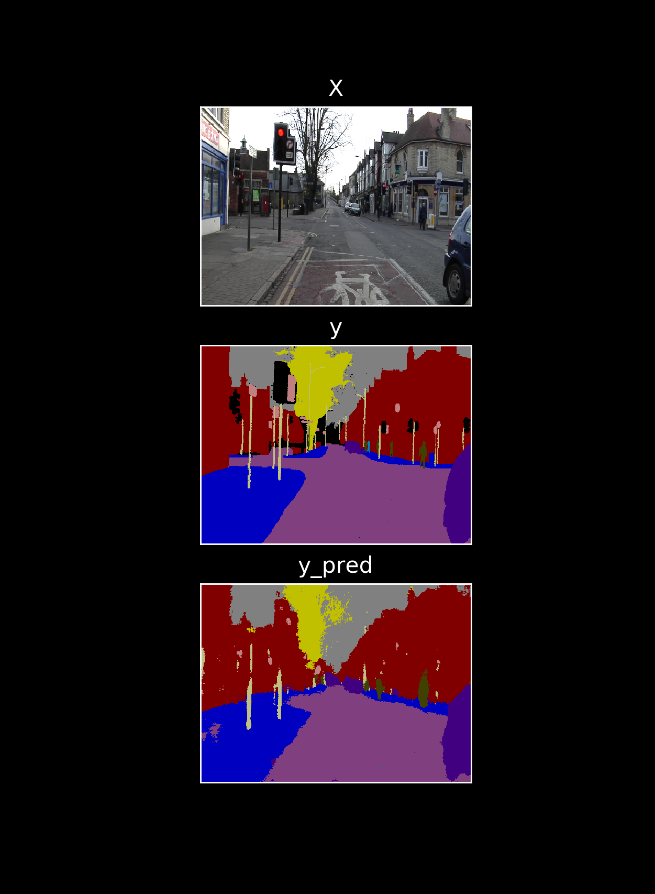
    </td>
  </tr>
</table>


## [Bayesian SegNet][Kendall et al. (2015)]


The following table describes training hyperparameters.

| Crop Size | Epochs | Batch Size | Patience | Optimizer | α    | 𝛃    | α Decay | Dropout | Samples |
|:----------|:-------|:-----------|:---------|:----------|:-----|:-----|:--------|:--------|:--------|
| 352 x 480 | 200    | 8          | 50       | SGD       | 1e-3 | 0.9  | 0.95    | 50%     | 40      |

-   batch normalization statistics computed per batch during training and
    using a rolling average computed over input batches for validation and
    testing
    -   original paper uses a static statistics computed over the training data
-   encoder transfer learning from VGG16 trained on ImageNet
    -   note that VGG16 does not have any dropout by default; transfer from a
        Bayesian VGG16 model could improve results
-   best model in terms of validation accuracy is kept as final model
-   median frequency balancing of class labels ([Eigen et al. (2014)][])
    -   weighted categorical cross-entropy loss function
-   local contrast normalization of inputs ([Jarrett et al. (2009)][])
-   pooling indexes ([Badrinarayanan et al. (2015)][])

### Quantitative Results

The following table outlines the testing results from Bayesian SegNet.

| Metric                  | Test Score |
|:------------------------|:-----------|
| Global Accuracy         | 0.854635
| Mean Per Class Accuracy | 0.634437
| Mean I/U                | 0.444531
| Bicyclist               | 0.097716
| Building                | 0.624091
| Car                     | 0.470470
| Column/Pole             | 0.180791
| Fence                   | 0.117226
| Pedestrian              | 0.252237
| Road                    | 0.866110
| Sidewalk                | 0.712532
| Sign                    | 0.148314
| Sky                     | 0.860612
| Vegetation              | 0.559742

### Qualitative Results

<table>
  <tr>
    <td>
      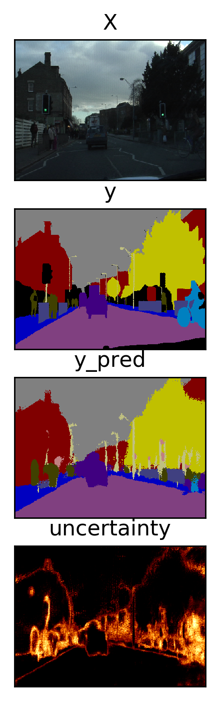
    </td>
    <td>
      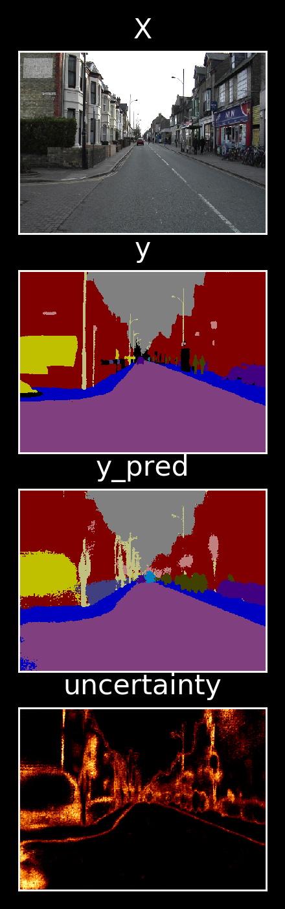
    </td>
    <td>
      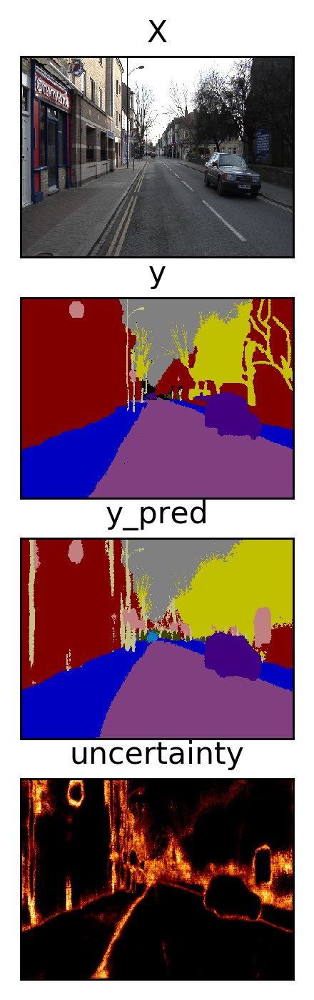
    </td>
    <td>
      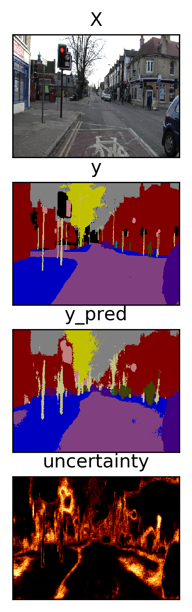
    </td>
  </tr>
</table>


## [The One Hundred Layers Tiramisu][Jégou et al. (2016)]

<table>
  <tr>
    <td>
        
    </td>
    <td>
        
    </td>
  </tr>
</table>

The following table describes training hyperparameters.

| Crop Size | Epochs | Batch Size | Patience | Optimizer | α    | α Decay | Dropout |
|:----------|:-------|:-----------|:---------|:----------|:-----|:--------|:--------|
| 224 x 224 | 200    | 3          | 100      | RMSprop   | 1e-3 | 0.995   | 20%     |
| 352 x 480 | 200    | 1          | 50       | RMSprop   | 1e-4 | 1.000   | 20%     |

-   random _horizontal_ flips of images during training
    -   the paper says vertical, but their implementation clearly shows
        horizontal flips (likely a typo). Horizontal make more sense than
        vertical anyway and produces empirically better test results
-   batch normalization statistics computed _per batch_ during training,
    validation, and testing
-   skip connections between encoder and decoder ([Jégou et al. (2016)][])

### Quantitative Results

The following table outlines the testing results from 103 Layers Tiramisu.

| Metric                  | Test Score |
|:------------------------|:-----------|
| Global Accuracy         | 0.893243
| Mean Per Class Accuracy | 0.645533
| Mean I/U                | 0.499167
| Bicyclist               | 0.098403
| Building                | 0.709252
| Car                     | 0.548525
| Column/Pole             | 0.294447
| Fence                   | 0.098811
| Pedestrian              | 0.342050
| Road                    | 0.900283
| Sidewalk                | 0.787167
| Sign                    | 0.209551
| Sky                     | 0.907727
| Vegetation              | 0.594623

### Qualitative Results

<table>
  <tr>
    <td>
      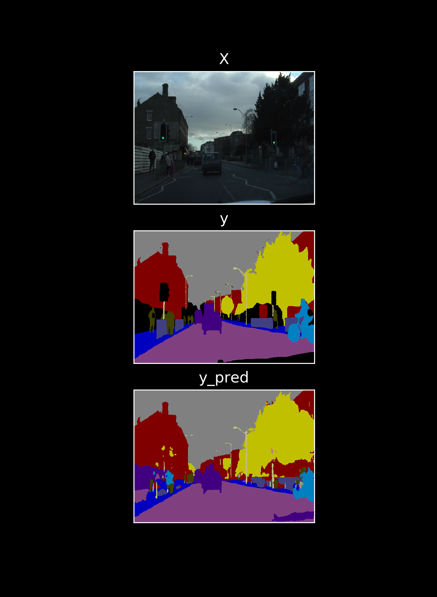
    </td>
    <td>
      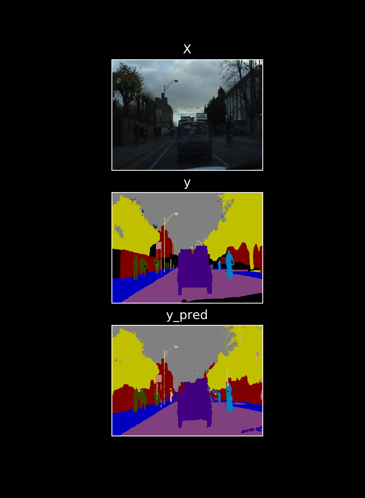
    </td>
    <td>
      
    </td>
    <td>
      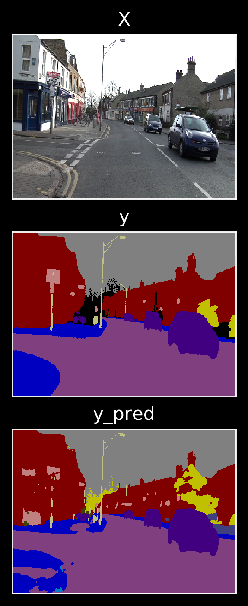
    </td>
  </tr>
</table>


## [Bayesian Tiramisu][Kendall et al. (2017)]

### Epistemic Uncertainty

-   pre-trained with fine weights from original Tiramisu
-   50 samples for Monte Carlo Dropout sampling at test time

#### Quantitative Results

The following table outlines the testing results from Epistemic Tiramisu.

| Metric                  | Test Score |
|:------------------------|:-----------|
| Global Accuracy         | 0.900153
| Per Class Accuracy      | 0.623793
| Mean I/U                | 0.498584
| Bicyclist               | 0.111818
| Building                | 0.723211
| Car                     | 0.541242
| Column/Pole             | 0.270681
| Fence                   | 0.076327
| Pedestrian              | 0.353104
| Road                    | 0.899739
| Sidewalk                | 0.788833
| Sign                    | 0.197824
| Sky                     | 0.909898
| Vegetation              | 0.611748

#### Qualitative Results

<table>
  <tr>
    <td>
      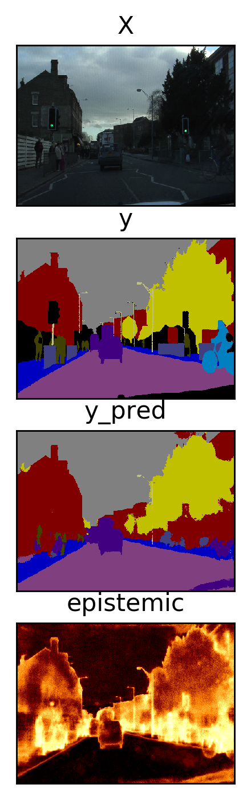
    </td>
    <td>
      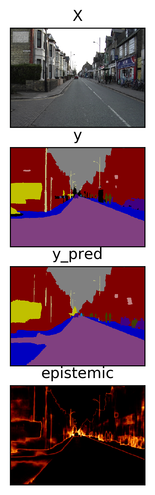
    </td>
    <td>
      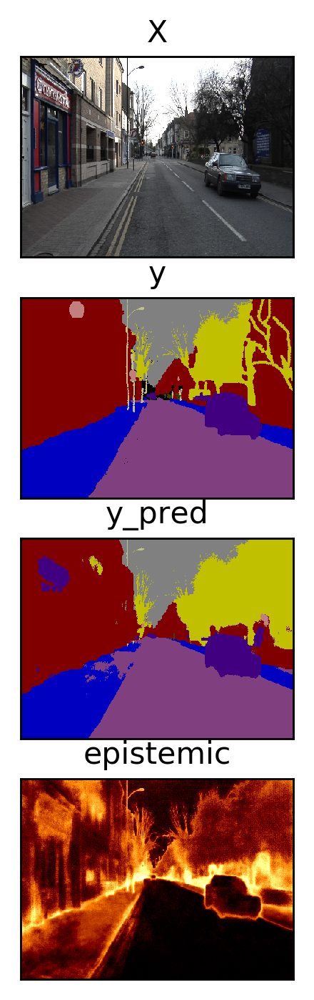
    </td>
    <td>
      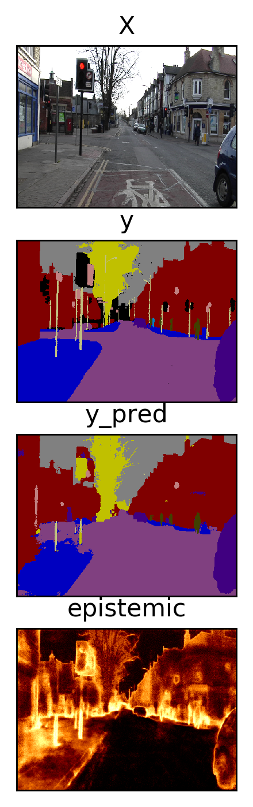
    </td>
  </tr>
</table>

<!-- ### Aleatoric Uncertainty

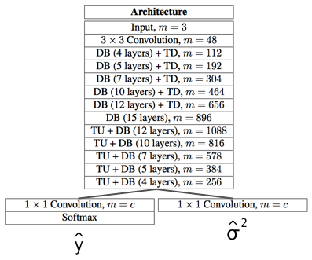

-   network split to predict targets and loss attenuation
    -   masked categorical cross entropy to train the target head of the
        network
    -   custom loss function to train the second head of the network
        ([Kendall et al. (2017)][])

#### Quantitative Results

The following table outlines the testing results from Aleatoric Tiramisu.

| Metric                  | Test Score |
|:------------------------|:-----------|

#### Qualitative Results

<table>
  <tr>
    <td>
      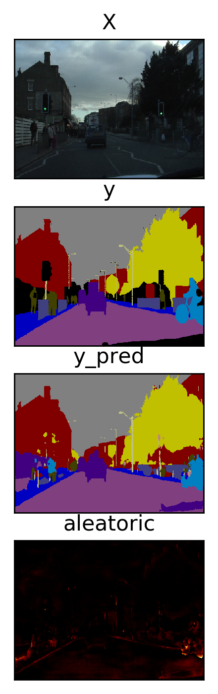
    </td>
    <td>
      
    </td>
    <td>
      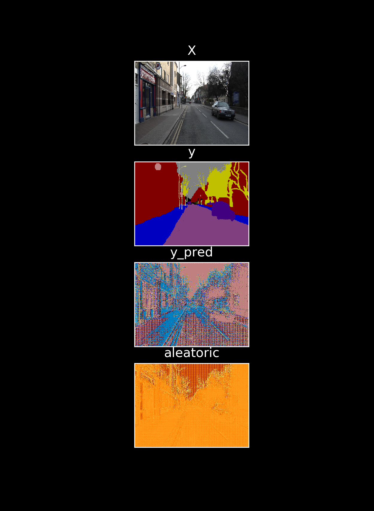
    </td>
    <td>
      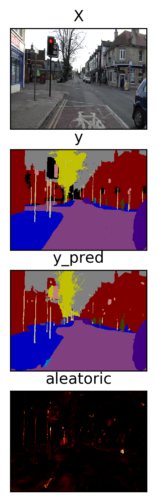
    </td>
  </tr>
</table> -->

<!-- ### Hybrid Bayesian Tiramisu

-   pre-trained with fine weights from Aleatoric Tiramisu
-   50 samples for Monte Carlo Dropout sampling at test time
    -   aleatoric uncertainty averaged the same as targets

#### Quantitative Results

The following table outlines the testing results from Hybrid Tiramisu
(Aleatoric + Epistemic).

| Metric                  | Test Score |
|:------------------------|:-----------|

#### Qualitative Results

<table>
  <tr>
    <td>
      
    </td>
    <td>
      
    </td>
    <td>
      
    </td>
    <td>
      
    </td>
  </tr>
</table> -->

# Wall Clock Inference Times

The following box plot describes the mean and standard deviation in wall clock
time execution of different segmentation models performing inference on images
of size 352 x 480 pixels.

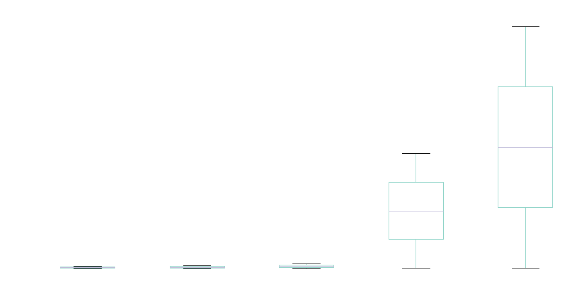

# References

[Badrinarayanan V, Kendall A, Cipolla R (2015) SegNet: A Deep Convolutional Encoder-Decoder Architec- ture for Image Segmentation. ArXiv e-prints.][Badrinarayanan et al. (2015)]

[Eigen D, Fergus R (2014) Predicting Depth, Surface Normals and Semantic Labels with a Common Multi- Scale Convolutional Architecture. ArXiv e-prints.][Eigen et al. (2014)]

[Jarrett K, Kavukcuoglu K, Ranzato M, LeCun Y (2009) What is the best multi-stage architecture for object recognition? 2009 IEEE 12th International Conference on Computer Vision, 2146–2153.][Jarrett et al. (2009)]

[Jégou S, Drozdzal M, Vazquez D, Romero A, Bengio Y (2016) The One Hundred Layers Tiramisu: Fully Convolutional DenseNets for Semantic Segmentation. ArXiv e-prints.][Jégou et al. (2016)]

[Kendall A, Badrinarayanan V, Cipolla R (2015) Bayesian SegNet: Model Uncertainty in Deep Convolutional Encoder-Decoder Architectures for Scene Understanding. ArXiv e-prints.][Kendall et al. (2015)]

[Kendall A, Gal Y (2017) What Uncertainties Do We Need in Bayesian Deep Learning for Computer Vision? ArXiv e-prints.][Kendall et al. (2017)]

[Badrinarayanan et al. (2015)]: https://arxiv.org/abs/1511.00561
[Eigen et al. (2014)]: https://arxiv.org/abs/1411.4734
[Jarrett et al. (2009)]: https://ieeexplore.ieee.org/document/5459469
[Jégou et al. (2016)]: https://arxiv.org/abs/1611.09326
[Kendall et al. (2015)]: https://arxiv.org/abs/1511.02680
[Kendall et al. (2017)]: https://arxiv.org/abs/1703.04977
